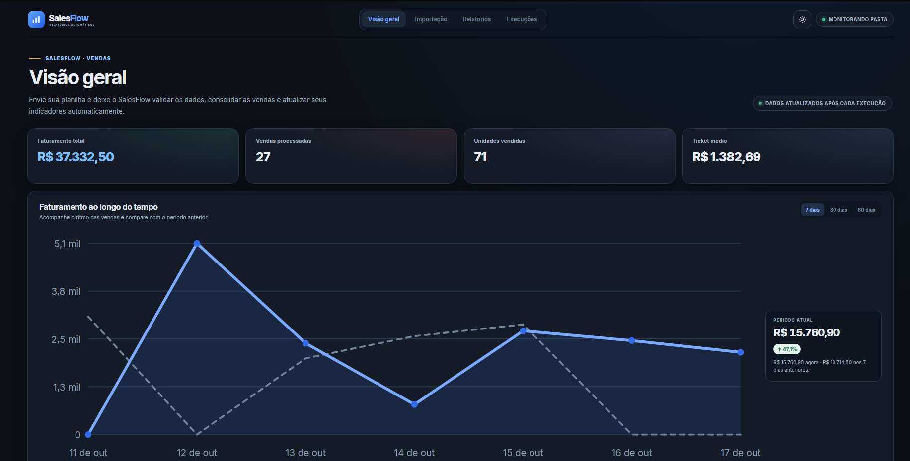
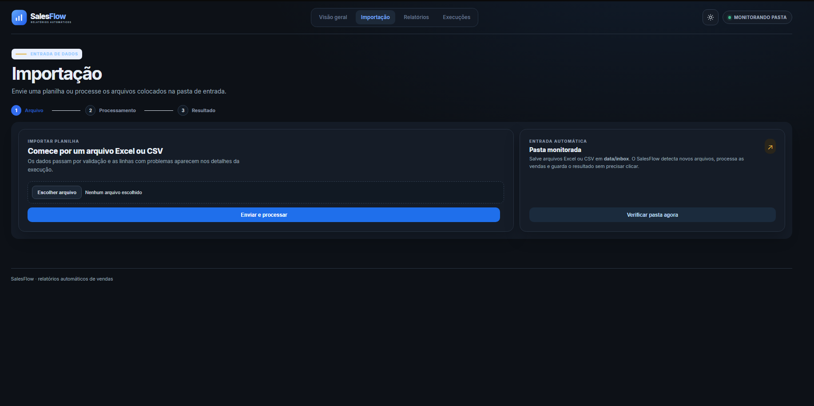
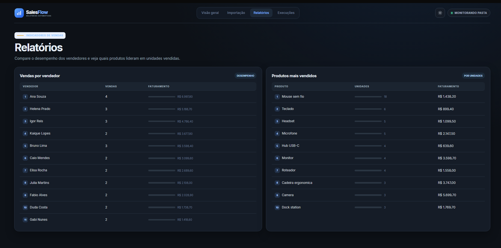
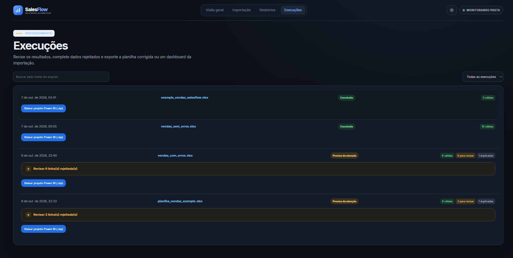
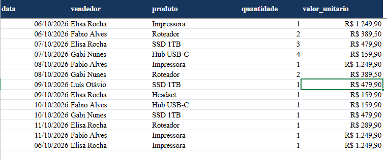
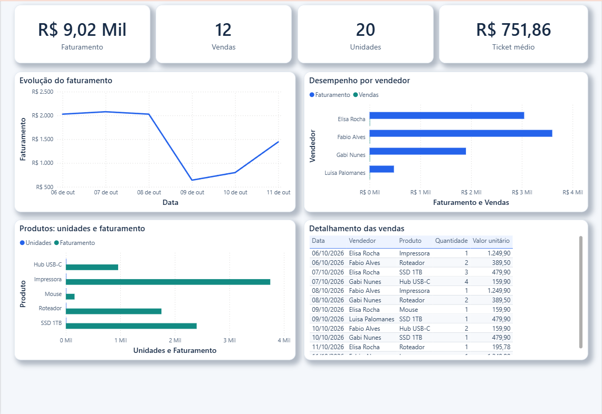

# SalesFlow — Relatórios Automáticos de Vendas

O SalesFlow importa planilhas Excel ou CSV, valida cada venda, evita duplicidades e atualiza indicadores de vendas. Também registra cada execução, permite revisar linhas rejeitadas, exporta uma planilha corrigida e gera um projeto Power BI (PBIP) com os dados daquela execução.

> O dashboard web é o painel operacional do SalesFlow. A exportação Power BI é um projeto separado por execução; abra o `.pbip` no Power BI Desktop e use **Salvar como** para criar um `.pbix`.

## Visão geral das telas

### Visão geral

A página inicial resume faturamento, vendas processadas, unidades e ticket médio. O gráfico de evolução permite acompanhar o faturamento e compará-lo ao período anterior.



### Importação e pasta monitorada

Você pode enviar um Excel/CSV pelo navegador ou copiar o arquivo para `data/inbox`. O monitor verifica a pasta a cada cinco segundos e inicia o processamento depois que o arquivo permanece estável em duas verificações.



### Relatórios

A página de relatórios compara o desempenho de vendedores e produtos, mostrando vendas, unidades e faturamento.



### Execuções

O histórico mostra o nome do arquivo, horário, status e quantidade de linhas aceitas ou que precisam de revisão. Linhas rejeitadas podem ser corrigidas antes de exportar a planilha corrigida ou o projeto Power BI.



### Planilha de entrada

A planilha deve ter uma linha de cabeçalhos e as colunas `data`, `vendedor`, `produto`, `quantidade` e `valor_unitario`. A ordem das colunas pode variar. Maiúsculas, espaços e acentos nos cabeçalhos são normalizados.



### Dashboard exportado para Power BI

O projeto exportado inclui cartões de faturamento, vendas, unidades e ticket médio, evolução do faturamento, análise por vendedor e por produto e uma tabela detalhada de vendas. Os visuais seguem a identidade visual do SalesFlow.



## Funcionalidades

- Importação de arquivos `.xlsx`, `.xlsm` e `.csv`.
- Validação de data, vendedor, produto, quantidade e valor unitário.
- Registro das linhas rejeitadas com o motivo para facilitar a correção.
- Detecção de vendas duplicadas.
- Atualização dos indicadores de faturamento, vendas, unidades, ticket médio, vendedores e produtos.
- Processamento automático da pasta `data/inbox` (intervalo padrão de cinco segundos).
- Movimentação de arquivos concluídos para `data/inbox/processed` e de arquivos que não puderam ser lidos para `data/inbox/failed`.
- Exportação de planilha corrigida em Excel, desde que todas as linhas rejeitadas tenham sido preenchidas.
- Exportação de projeto Power BI `.pbip` com os dados corrigidos daquela execução.
- API HTTP documentada automaticamente pelo FastAPI em `/docs`.

## Requisitos

- Python 3.12 (Python 3.11 ou superior também é aceito pelo aplicativo).
- Git para clonar o repositório.
- Opcional: Docker Desktop e Docker Compose para executar a aplicação e PostgreSQL em contêineres.
- Para abrir a exportação Power BI: Power BI Desktop. O aplicativo exporta `.pbip`; para obter `.pbix`, abra o projeto e salve no Desktop.

## Executar localmente

No terminal, entre na pasta do projeto e crie um ambiente virtual:

```powershell
python -m venv .venv
.\.venv\Scripts\Activate.ps1
python -m pip install --upgrade pip
pip install -r requirements.txt
uvicorn app.main:app --reload
```

No PowerShell, caso a ativação de scripts esteja bloqueada, use o caminho direto do executável do ambiente:

```powershell
.\.venv\Scripts\python.exe -m pip install -r requirements.txt
.\.venv\Scripts\python.exe -m uvicorn app.main:app --reload
```

Abra <http://127.0.0.1:8000>. A documentação interativa da API fica em <http://127.0.0.1:8000/docs>.

Por padrão, o SalesFlow cria o banco SQLite e as pastas de trabalho sob `data/`.

## Executar com Docker Compose

```bash
docker compose up --build
```

O Compose inicia a aplicação na porta `8000` e um PostgreSQL na porta `5432`. Os arquivos de trabalho ficam montados em `./data`, para persistirem entre reinícios dos contêineres. Para encerrar:

```bash
docker compose down
```

Os dados do PostgreSQL ficam no volume `postgres_data`; `docker compose down -v` também remove esse volume e apaga os dados persistidos.

## Colunas e validação da planilha

Cabeçalhos aceitos (os nomes são normalizados, por isso espaços, acentos e maiúsculas não são significativos):

| Campo | Exemplos de cabeçalho | Validação |
|---|---|---|
| Data | `data`, `date`, `data venda` | Data reconhecida, como `07/10/2026` |
| Vendedor | `vendedor`, `seller`, `representante` | Texto não vazio |
| Produto | `produto`, `product`, `item` | Texto não vazio |
| Quantidade | `quantidade`, `quantity`, `qtd` | Número inteiro maior que zero |
| Valor unitário | `valor_unitario`, `valor`, `preco unitario`, `price` | Valor numérico maior ou igual a zero; aceita, por exemplo, `R$ 1.234,56` |

A imagem de exemplo mostra a estrutura e os tipos de valor esperados. O arquivo de demonstração sem dados reais também está em `examples/`.

## Fluxo de uma importação

1. Envie o arquivo na página **Importação** ou copie-o para `data/inbox`.
2. O SalesFlow valida cada linha e registra a execução. A pasta é verificada automaticamente a cada cinco segundos; após duas verificações com o arquivo estável, o monitor tenta processá-lo.
3. Linhas válidas entram nos indicadores. Linhas repetidas são contadas como duplicadas. Linhas inválidas ficam disponíveis para revisão em **Execuções**.
4. Preencha os campos faltantes ou inválidos e baixe a planilha corrigida. A exportação não é permitida enquanto houver erros sem correção.
5. Reimporte a planilha corrigida se quiser que as linhas corrigidas também entrem nos indicadores gerais.
6. Na execução, escolha **Baixar projeto Power BI (.zip)**. Extraia o ZIP inteiro, abra o `.pbip` no Power BI Desktop e, se quiser o arquivo binário, use **Arquivo > Salvar como > Power BI Desktop (.pbix)**.

O PBIP é um retrato dos dados da execução exportada; ele não fica conectado à pasta monitorada. Para atualizar os dados do Power BI, exporte um novo projeto depois de processar uma nova planilha.

## Pastas de dados

- `data/inbox/`: arquivos aguardando processamento.
- `data/inbox/processed/`: arquivos processados com sucesso.
- `data/inbox/failed/`: arquivos que não puderam ser lidos.
- `data/sources/`: cópias das planilhas originais usadas para correção e exportação.
- `data/reports/`: relatórios JSON/CSV consolidados.
- `data/sales.db`: banco SQLite padrão; não é usado quando `DATABASE_URL` aponta para PostgreSQL.

O conteúdo de `data/`, incluindo planilhas e o banco local, não deve ser enviado ao GitHub. O `.gitignore` do projeto já exclui os arquivos de dados variáveis.

## Configuração

Copie `.env.example` para `.env` e ajuste conforme necessário. As variáveis principais são:

| Variável | Uso | Padrão |
|---|---|---|
| `DATABASE_URL` | URL do banco SQL | SQLite em `data/sales.db` |
| `INBOX_DIR` | Pasta monitorada | `data/inbox` |
| `REPORT_DIR` | Saída dos relatórios JSON/CSV | `data/reports` |
| `AUTO_PROCESS_INBOX` | Liga/desliga o monitor | `true` |
| `INBOX_POLL_SECONDS` | Intervalo da verificação | `5` |

No Compose, essas variáveis já são definidas para usar o serviço PostgreSQL e o volume local `./data`.

## API principal

| Método | Rota | Descrição |
|---|---|---|
| `POST` | `/api/process/upload` | Envia e processa uma planilha |
| `POST` | `/api/process/inbox` | Solicita uma verificação da pasta de entrada |
| `GET` | `/api/reports/summary` | Retorna indicadores consolidados |
| `GET` | `/api/runs` | Lista execuções recentes |
| `GET` | `/api/runs/{run_id}` | Consulta uma execução e suas linhas rejeitadas |
| `POST` | `/api/runs/{run_id}/corrected-export` | Valida correções e baixa o Excel corrigido |
| `POST` | `/api/runs/{run_id}/powerbi-export` | Baixa o projeto Power BI daquela execução |
| `GET` | `/api/reports/export?format=json` | Baixa o consolidado em JSON (também aceita `csv`) |

A documentação OpenAPI, com os schemas de requisição e resposta, fica em `/docs`.

## GitHub Actions

O workflow `.github/workflows/ci.yml` roda em cada `push`, `pull_request` e também pode ser iniciado manualmente pela aba **Actions**. Ele:

1. prepara Python 3.12 e instala as dependências;
2. verifica a sintaxe dos módulos Python;
3. constrói a imagem Docker para detectar erros no `Dockerfile` e nas dependências de contêiner.

O workflow é CI: ele valida e constrói, mas **não publica uma imagem em registry nem faz deploy**. Não precisa configurar secrets para a validação atual. Depois de criar um repositório GitHub e enviar este projeto, acesse a aba **Actions** para acompanhar as execuções.

### Publicar este projeto pelo VS Code

1. Abra no VS Code a pasta `relatorio-automatico`, que é a raiz deste projeto.
2. Em **Source Control**, clique em **Initialize Repository**.
3. Revise os arquivos antes do commit. Os exemplos de demonstração ficam em `examples/` e podem ser versionados. O `.gitignore` exclui `data/` e `exports/`, que contêm dados de execução, planilhas importadas e projetos Power BI gerados.
4. Faça o primeiro commit com o aplicativo, o workflow, os exemplos e a documentação.
5. Clique em **Publish to GitHub**, escolha o nome do repositório e defina se ele será público ou privado. Depois do primeiro push, acompanhe as execuções na aba **Actions** do GitHub.

## Exemplos de entrada

- `examples/vendas_exemplo.csv`: arquivo CSV pequeno para testar a importação.
- `examples/vendas_sem_erros.xlsx`: planilha válida.
- `examples/vendas_com_erros.xlsx`: planilha com dados para exercitar a revisão de linhas.

Use apenas dados de teste ao compartilhar capturas, logs ou execuções no GitHub.

